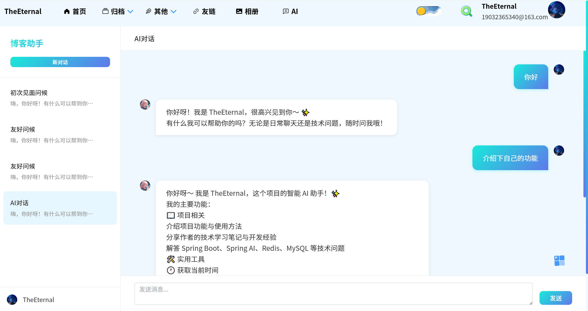

# 智墨 - AI 智能博客系统

> 一个融合了前沿 AI 能力的现代化博客系统，不仅具备完善的 CMS 内容管理能力，更通过 Spring AI 赋予了博客“思考”与“执行”的能力。

🌐 项目地址：

后端：https://gitee.com/theeternalzz/personal-blog---backend 或 https://github.com/TheEternal233/personal-blog-backend

前端（用户）：https://gitee.com/theeternalzz/personal-blog---front-end 或 https://github.com/TheEternal233/personal-blog-frontend

前端（管理）：https://gitee.com/theeternalzz/personal-blog-admin 或 https://github.com/TheEternal233/personal-blog-admin

## 主页展示

## ✨ 项目亮点

🧠 深度集成 LLM：基于 Spring AI 接入智谱 GLM-4，支持上下文感知的多轮对话，记忆持久化保障对话连贯。
🛠️ Function Calling：让 AI 不再只是“说话”，通过自定义工具类，AI 能够主动调用本地业务接口（获取时间、生成密码等），具备实际执行能力。
📚 RAG 知识库增强：集成 Qdrant 向量数据库与 Embedding 模型，私有知识向量化存储，语义级精准检索，有效抑制大模型幻觉。
🛡️ 非侵入式日志架构：AOP + RabbitMQ 构建异步日志系统，业务代码零侵入，实现日志采集与落库的削峰填谷。
🔐 双模式认证体系：JWT + OAuth2.0，支持 Gitee/GitHub 第三方一键登录，兼顾安全与便捷。

## 🛠️ 技术栈

| 分类     | 技术                                                         |
| -------- | ------------------------------------------------------------ |
| 核心框架 | Spring Boot                                                  |
| AI 框架  | Spring AI (RAG, Function Calling, ChatMemory)                |
| 大模型   | 智谱 GLM-4 (对话), 智谱 Embedding-2 (向量化)                 |
| 数据存储 | MySQL (业务数据), Qdrant (向量数据), Redis (缓存/会话), MinIO (对象存储) |
| 中间件   | RabbitMQ (异步日志/消息削峰)                                 |
| ORM 框架 | MyBatis-Plus                                                 |
| 安全认证 | Spring Security, JWT, OAuth2.0                               |

## 🚀 核心功能模块

### 🤖 AI 智能助手模块

- 多轮对话记忆：基于 ChatMemory，将对话历史通过 AiSession 和 AiMessage 持久化至数据库，每次请求自动加载上下文。
- Function Calling：通过 AiFunctionUtil 将本地方法注册为 AI 可调用的 Function，AI 根据用户意图自主决定是否调用工具。
- RAG 知识库检索：文档导入时自动调用智谱 embedding-2 进行向量化存入 Qdrant；提问时先进行语义检索，将相关文档作为 Prompt 上下文喂给 GLM-4。

### 📝 博客内容管理模块

- 文章/分类/标签：基于 MyBatis-Plus 实现高效的关联查询与 CRUD。
- 图片资源管理：集成 MinIO 作为对象存储，支持文章配图的上传与回显。
- 评论系统：支持层级评论与交互。

文章编辑

文章详情

文章分类

### 相册

### 🛡️ 系统管理与安全模块

- 异步日志系统：自定义 @LogAnnotation，利用 AOP 切面捕获操作日志，通过 RabbitMQ 异步消费落库，实现核心业务与日志记录的完全解耦。
- 双模式认证：本地账号 JWT 认证 + Gitee/GitHub OAuth2.0 授权登录。

🖼️ 截图占位符 - 日志管理列表（展示多条件筛选）

🖼️ 截图占位符 - 第三方登录流程

### 其他功能
树洞

留言板

时间轴

## ⚙️ 项目运行指南

环境依赖:

> - JDK 17+
> - MySQL 8.0+
> - Redis 6.0+
> - RabbitMQ 3.8+
> - MinIO
> - Qdrant (推荐使用 Docker 部署)

配置修改

克隆项目后，需修改 **application.yml** 中的相关配置

### 数据库配置

~~~java
spring:
  datasource:
    url: jdbc:mysql://localhost:3306/your_db_name
    username: root
    password: your_password
~~~

### Redis 配置

~~~java
  data:
    redis:
      host: localhost
      port: 6379
~~~

### MinIO 配置

~~~java
minio:
  endpoint: http://localhost:9000
  access-key: your-access-key
  secret-key: your-secret-key
~~~

### 智谱 AI 配置 (需自行申请 API Key)

~~~java
spring:
  ai:
    zhipuai:
      api-key: your-zhipuai-api-key
~~~

### Qdant 配置

~~~java
qdrant:
  host: localhost
  port: 6333
~~~

**初始化数据库**
执行项目中的 SQL 初始化脚本（如有，请指明路径，如 doc/sql/init.sql）。

本项目采用 MIT License 开源协议。
